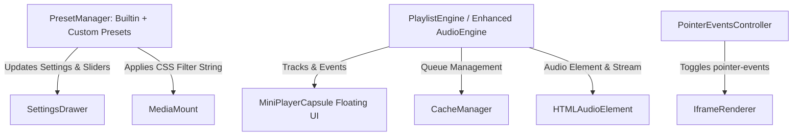

# Technical Design: Filter Presets, Audio Playlist & Interactive Sandbox

## 1. System Additions & Architecture



### 1.1 Preset Architecture
- `BUILTIN_PRESETS`: Map of preset names to `VisualFilters`.
- `userPresets`: Record<string, VisualFilters> persisted in localStorage under `st_bgloader_user_presets`.
- Selection event updates `settings.filters` and calls `mediaMount.applyFilters()`.

### 1.2 Playlist Architecture
- `PlaylistManager` class encapsulating:
  - `items: MediaItem[]`
  - `mode: 'loop' | 'single' | 'shuffle'`
  - `currentIndex: number`
  - Methods: `playNext()`, `playPrev()`, `setMode(m)`, `addToPlaylist()`, `removeFromPlaylist()`.
  - Automatically bound to `audio.addEventListener('ended', () => playlistManager.onTrackEnded())`.

### 1.3 Floating Mini Player UI
- Mounts directly to `#chat` or `body`.
- Compact glassmorphic pill (`.st-bg-mini-player`).
- Controls:
  - Prev icon (`fa-backward-step`)
  - Play/Pause icon (`fa-play` / `fa-pause`)
  - Next icon (`fa-forward-step`)
  - Track label marquee with overflow scroll.
  - Can be toggled on/off in settings drawer.

---

## 2. Updated Data Schemas

```typescript
export type PlaybackMode = 'loop' | 'single' | 'shuffle';

export interface FilterPreset {
    id: string;
    name: string;
    isCustom: boolean;
    filters: VisualFilters;
}

export interface BgLoaderSettings {
    // ... existing properties ...
    interactiveBackground: boolean;       // whether iframe captures pointer events
    showMiniPlayer: boolean;              // whether to display floating capsule
    playbackMode: PlaybackMode;           // audio playlist mode
    playlist: string[];                   // array of mediaItem IDs
    userPresets: Record<string, VisualFilters>; // custom filter presets
}
```
