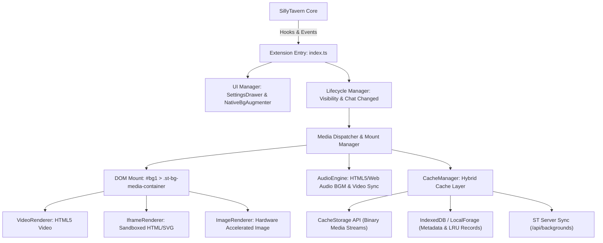
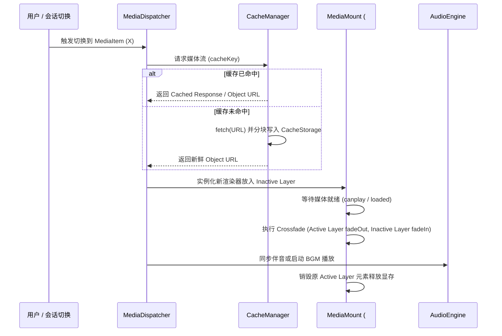

# Technical Design: Rich Media Background Plugin (ST-BgLoader)

## 1. System Architecture & Boundaries



### Module Boundaries
1. **`core/MediaMount.ts`**:
   - 托管在 `#bg1` 之内的 `.st-bg-media-container` 单一受控视图。
   - 双缓冲过渡切换机制（Active Layer 与 Inactive Layer 相互淡入淡出，消除黑屏闪烁）。
   - 保持与 `#bg1` 原生适配类（`.cover`, `.contain`, `.stretch`, `.center`）同步。
2. **`renderers/`**:
   - `VideoRenderer.ts`：负责 `<video>` 的创建、循环、硬解属性绑定、透明通道检测与错误回退。
   - `IframeRenderer.ts`：负责创建具有严密安全沙箱限制的 `<iframe sandbox="allow-scripts allow-same-origin">`，支持 HTML 动效与 SVG 交互。
   - `ImageRenderer.ts`：用于快速退化呈现传统静态或动图图片。
3. **`audio/AudioEngine.ts`**:
   - 统一音频管理，提供主音量、静音控制、淡入淡出曲线（100ms - 500ms），响应 `visibilitychange`（后台自动静音/暂停）。
4. **`cache/CacheManager.ts`**:
   - 流式二进制数据存入命名 CacheStorage（`st-bg-cache-v1`）。
   - 元数据和访问时间戳由 IndexedDB 维护。
   - 每次读取或写入时更新 `lastUsedTimestamp`，超过配额阈值（默认 1GB）时执行 LRU 批量淘汰。
5. **`ui/`**:
   - `SettingsDrawer.ts`：渲染 ST 扩展主菜单面板，提供媒体导入（拖拽、URL）、实时滤镜滑块、音量控制器、缓存空间图表与清理按钮。
   - `NativeBgAugmenter.ts`：轻量增强 ST 原生 `#bg_menu_content`，给非图片媒体添加角标，捕获点击无缝派发至插件调度器。

---

## 2. Data Contracts & Storage Schema

### 2.1 Media Item Schema
```typescript
export type MediaType = 'video' | 'audio' | 'html' | 'svg' | 'image';
export type MediaSource = 'local' | 'url' | 'server';

export interface MediaItem {
    id: string;                       // UUID 或 规范化文件名
    name: string;                     // 显示标题
    type: MediaType;                  // 媒体分类
    source: MediaSource;              // 来源
    url: string;                      // 原始地址或 Blob URL
    cacheKey: string;                 // CacheStorage 索引键
    size: number;                     // 字节大小
    mimeType: string;                 // MIME 类型
    addedTimestamp: number;           // 入库时间戳
    lastUsedTimestamp: number;        // LRU 淘汰时间戳
    thumbnailUrl?: string;            // 缩略图地址 (Base64 或 Blob URL)
    hasAudio?: boolean;               // 视频是否携带音轨
}
```

### 2.2 Extension Settings Schema
```typescript
export interface VisualFilters {
    blur: number;                     // 0 - 20 (px)
    brightness: number;               // 0 - 200 (%)
    opacity: number;                  // 0 - 100 (%)
    saturate: number;                 // 0 - 200 (%)
}

export interface BgLoaderSettings {
    enabled: boolean;
    activeMediaId: string | null;     // 全局当前生效的媒体 ID
    volume: number;                   // 0.0 - 1.0
    muted: boolean;
    pauseOnBlur: boolean;             // 页面失焦/后台时是否挂起
    filters: VisualFilters;
    cacheQuotaMB: number;             // 缓存限额，默认 1024 (1GB)
    lruAutoClean: boolean;            // 是否启用 LRU 自动清理
    chatBindings: Record<string, string>; // chatId -> mediaId 绑定表
}
```

---

## 3. Core Interaction & Data Flows

### 3.1 媒体加载与双缓冲平滑切换


### 3.2 离焦与性能自适应控制
- 监听 `document.addEventListener('visibilitychange', ...)`
- 当 `document.hidden === true`：
  - 记录当前视频播放时间点 `video.currentTime` 并调用 `video.pause()`。
  - 音频引擎执行线性淡出并挂起 AudioContext / Audio 元素。
  - 沙箱 `iframe` 通过 PostMessage 广播 `ST_BG_VISIBILITY_CHANGE: false`，通知内部动画暂停 `requestAnimationFrame`。
- 当 `document.hidden === false`：
  - 恢复视频硬件播放与音频淡入，通知 `iframe` 恢复渲染。

---

## 4. Error Handling & Rollback Strategy

1. **媒体解码异常**：若特定视频编码不受宿主浏览器支持，捕获 `HTMLVideoElement.onerror`，弹出友好 Toast 提示，并平滑回退至备用静态壁纸，避免白屏。
2. **沙箱逃逸与异常**：`iframe` 严格配置 `sandbox="allow-scripts allow-same-origin"`，禁止 `allow-top-navigation`、`allow-popups` 等高危权限；捕获 iframe 通信异常。
3. **存储空间超限**：捕获 `QuotaExceededError`，立即激活 LRU 回收程序，腾出空间后重试；若依然不足则直接降级为内存直读流，不影响当前播放。
