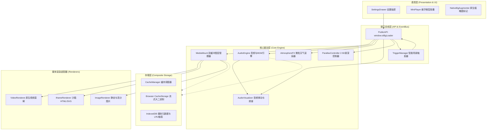

# Architecture & Design (系统架构与解耦设计)

ST-BgLoader 遵循现代高内聚、低耦合的模块化设计哲学。所有扩展子系统（天气、视觉律动、景深视差、智能触发器、音频隔音滤波）皆设计为**即插即用、相互隔离的自洽独立系统**。

---

## 🏗️ 核心架构全景图



---

## ⚡ 绝对解耦与零负载保证 (Zero-Cost Abstraction)

在浏览器前端运行富媒体及粒子动效时，CPU/GPU 资源的节制性至关重要。ST-BgLoader 实现了严格的**按需运行与绝对零开销原则**：

1. **天气粒子系统 (`AtmosphereFX`)**：
   - 当 `weather.type === 'off'` 时，粒子模拟循环完全停止（调用 `cancelAnimationFrame`），Canvas 设为 `display: none` 并立即清空上下文，卸载全部粒子数组与涟漪队列。
   - **空闲 CPU 消耗：0.00%**。
2. **音频频谱与低音律动 (`AudioVisualizer`)**：
   - 当 `visualizer.mode === 'off'` 时，禁用频率采样，终止逐帧绘制，重置主背景缩放变换与明暗滤镜。
   - **空闲 CPU 消耗：0.00%**。
3. **2.5D 景深视差 (`ParallaxController`)**：
   - 当 `parallax.enabled === false` 时，移除全局 `window.mousemove` 监听器，中断弹簧阻尼 Lerp 插值循环，重置主容器 CSS `transform`。
   - **空闲 CPU 消耗：0.00%**。
4. **隔壁房间声学模拟 (`AudioEngine`)**：
   - 当 `muffleBGM === false` 时，Biquad 滤波器直接恢复 20,000 Hz 全通状态，不破坏直解管线。

---

## 🔄 双缓冲无缝淡入淡出与重入锁保护

为了在切换 4K 视频、HTML5 动效或高清大图时彻底消除白屏、闪烁或黑边，ST-BgLoader 采用了**图层 A/B 双缓冲机制 (Double-Buffering)**：

```
[Layer A]  (Active, Opacity: 1)  ------>  (Fading Out, Opacity: 0)  ------> Destroy
                                                 \
                                                  \ (Crossfade: 400ms)
                                                   v
[Layer B]  (Pre-mounted, Opacity: 0) --> (Fading In, Opacity: 1)   ------> Active
```

### 极限重入锁保护 (`crossfadeTimer`)
在极端情况下（例如用户快速连击不同的媒体卡片，或自动化脚本在 100ms 内发起 10 次切换请求）：
- 系统会在每次挂载新媒体前，立即检查并清除尚未完成的 `crossfadeTimer`；
- 瞬间销毁废弃图层的视频流或 Iframe 实例，将旧图层透明度强制归零；
- 保证整个 DOM 树中有且仅有 1 个激活图层与 1 个待过渡图层，彻底避免内存泄漏与多重音画叠加。

---

## 🎛️ WebAudio 信号图谱 (Audio Signal Pipeline)

```
[HTMLAudioElement / Video Source]
        │ (crossOrigin = "anonymous")
        ▼
[MediaElementAudioSourceNode]
        │
        ▼
[BiquadFilterNode (LowPass)]  <--- setMuffled(true: 800Hz / false: 20000Hz)
        │
        ▼
[AnalyserNode (FFT: 256)]     ---> AudioVisualizer (Pulse energy / Spectrum bars)
        │
        ▼
[AudioContext.destination]   ---> 硬件扬声器 / 耳机
```

1. **手势前置安全守卫**：浏览器普遍阻止未产生交互前的 AudioContext 自动发声。系统监听首次用户交互（`pointerdown`, `keydown`, `touchstart`），无缝唤醒 AudioContext 并平滑拉起音量（400ms 淡入），避免控制台报错。
2. **Lo-Fi 声学模拟**：采用二阶低通滤波器（`lowpass`，Q 值 1.0）。开启隔壁房间模式时，截止频率在 80ms 内指数过渡至 800Hz，滤除高频音质，呈现逼真的隔墙沉浸声。

---

## 💾 复合流式存储架构 (Composite Cache Architecture)

对于现代富媒体（数 MB 至上百 MB 的高清视频），传统 `localStorage` (上限 5MB 且同步阻塞) 无法胜任。ST-BgLoader 结合两项现代 Web Storage API：

1. **`CacheStorage`**：
   - 专门负责二进制流实体（Videos, Audios, HTMLs, Images）。
   - 通过流式读取，不占用 V8 JavaScript 堆内存。
   - 支持多线程并发预热与毫秒级读取。
2. **`IndexedDB`**：
   - 存储每个媒体的轻量元数据（`id`, `name`, `type`, `mimeType`, `size`, `addedTimestamp`, `lastUsedTimestamp`）。
   - 实现高可靠的 LRU 链表，根据设定的磁盘配额（如 1024MB）自动清理最久未使用的陈旧媒体。
